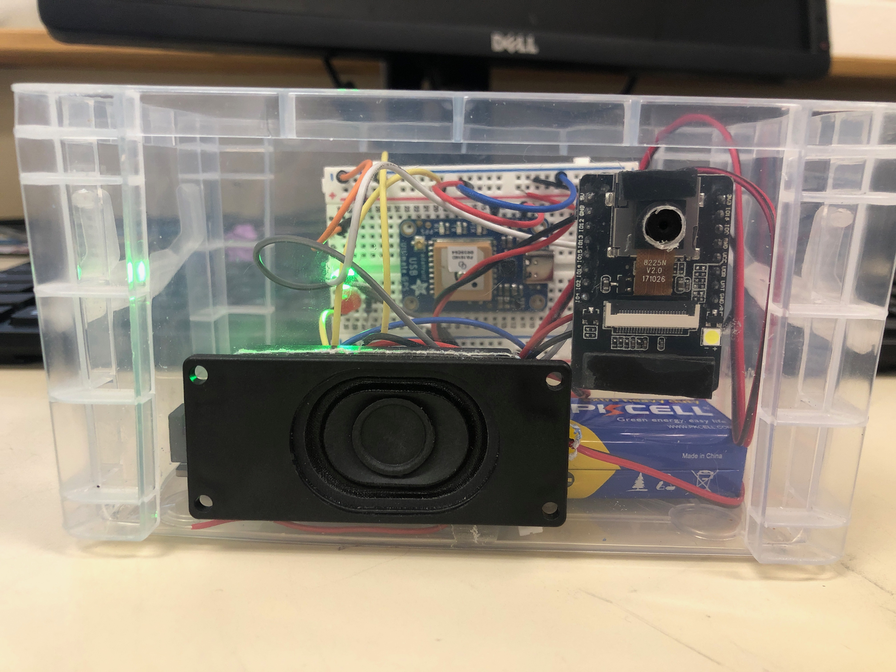
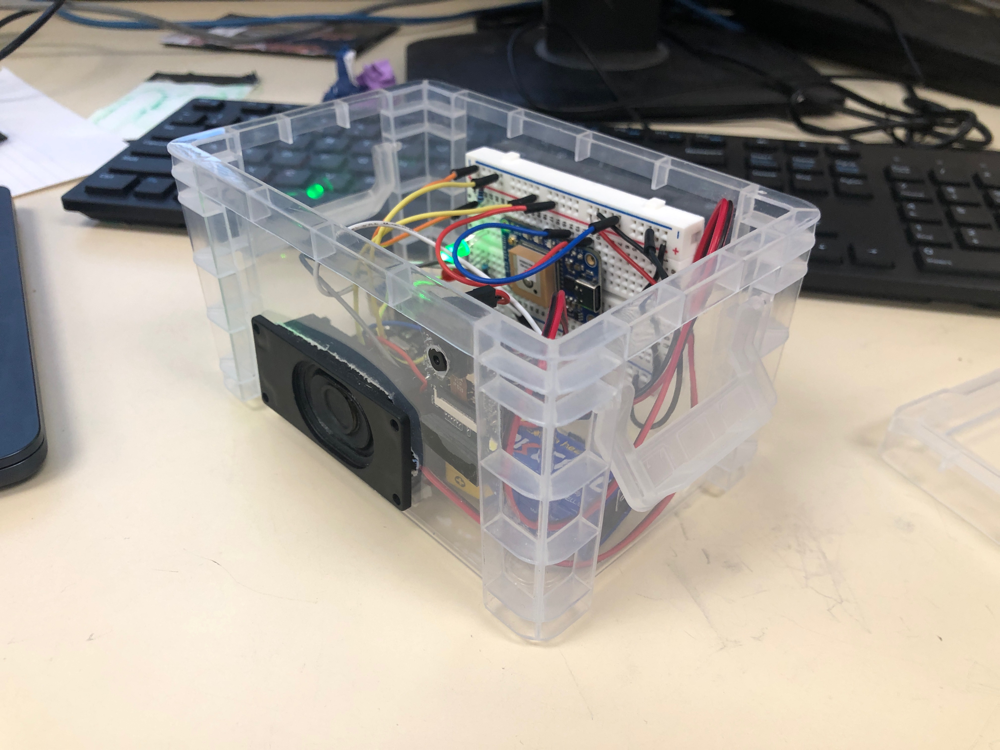
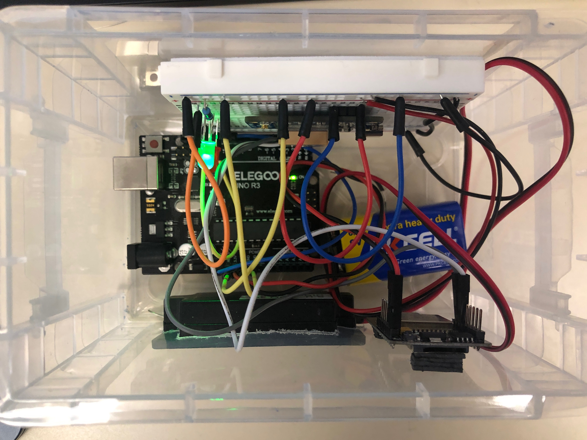
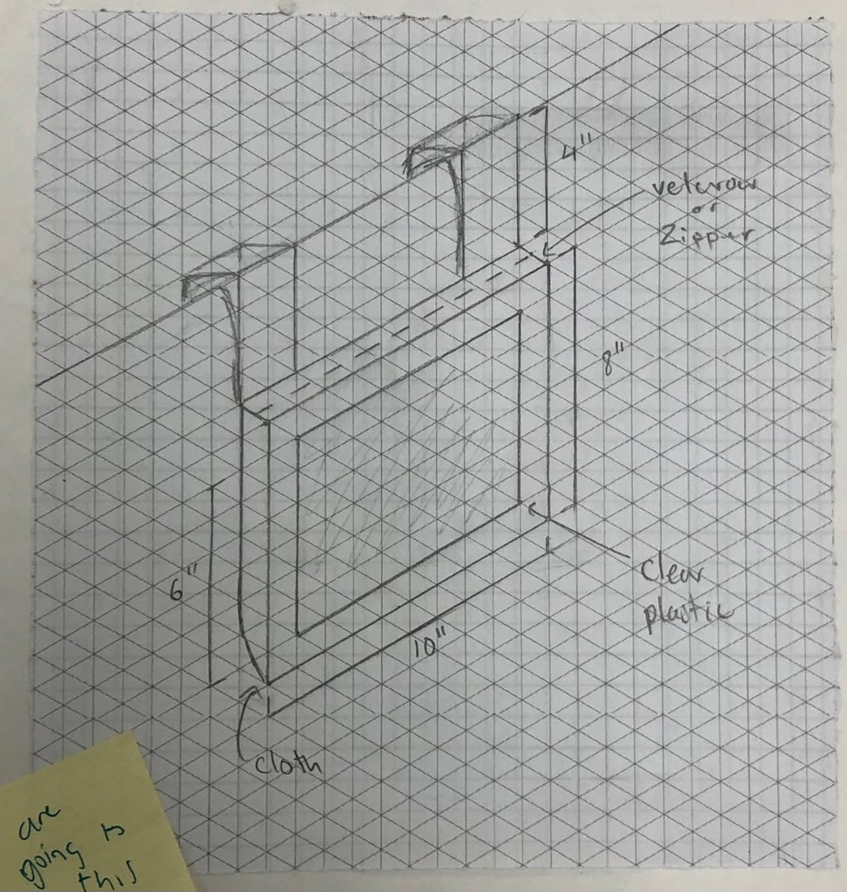
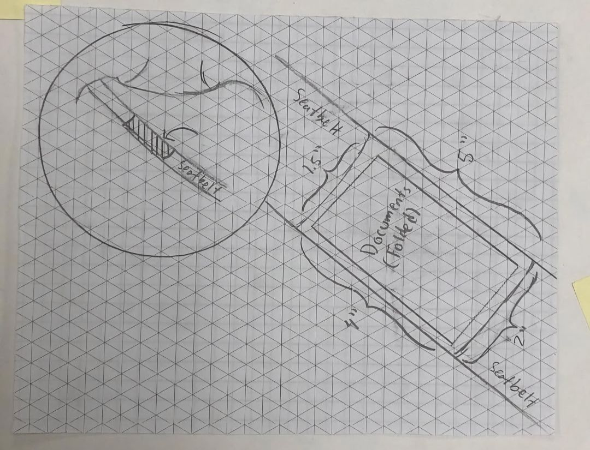
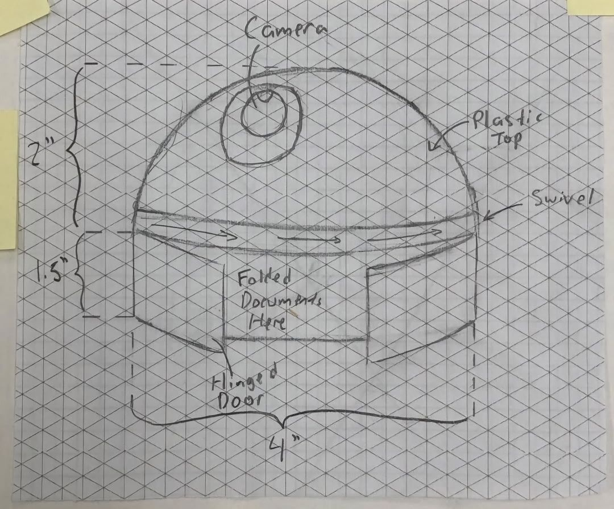
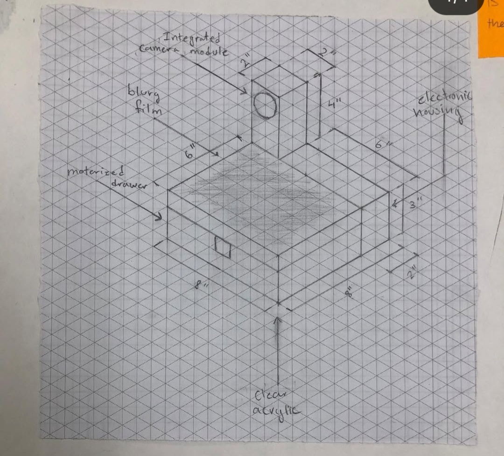
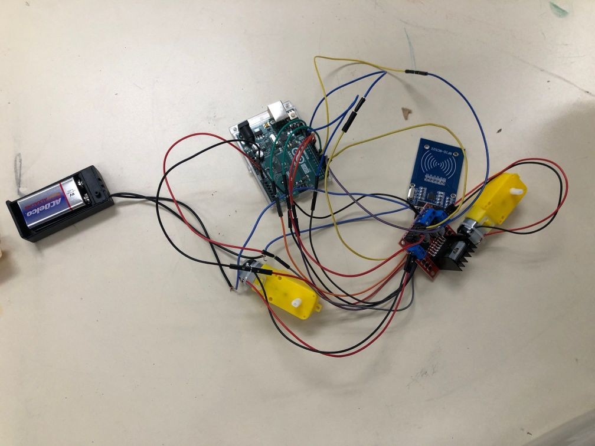
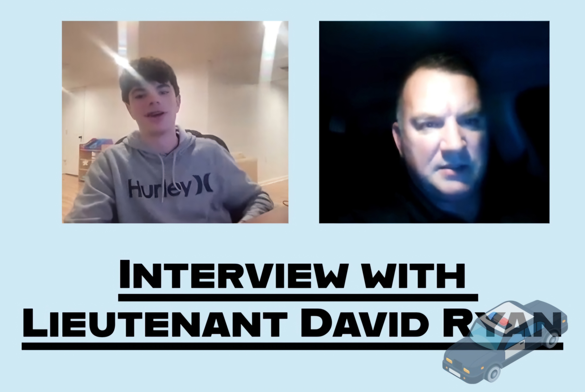

# Police Traffic Stop Safety Device

## Overview
This project provides a **digital document exchange system** for police traffic stops.  
By sending license and registration information virtually, we **reduce escalation risk during the first 7 seconds** of an interaction between an officer and a driver.  

This system integrates:
- **Arduino Uno R3**
- **ESP32-CAM** for image capture
- **Fingerprint sensor** for identity verification
- **Speaker** for feedback
- **Wi-Fi module** for secure, local data transmission

---

## Prototype

Our current prototype is enclosed in a clear housing for visibility and testing.

| Front View | Home View | Top View |
|------------|-----------|----------|
|  |  |  |

---

## Case Design Sketches

These sketches represent our brainstorming process for designing a secure, user-friendly case.

| Sketch 1 | Sketch 2 |
|----------|----------|
|  |  |

| Sketch 3 | Sketch 4 |
|----------|----------|
|  |  |

---

## Proof of Concept Wiring

Our early proof-of-concept wiring demonstrates the raw hardware setup before housing integration:

| Proof of Concept |
|----------|
|  |
---

## Interviews and Stakeholder Research

To ensure our solution aligns with **law enforcement needs** and **community expectations**, we interviewed key stakeholders in Maryland.

| Chao Wu (State Delegate) | Lt. David Ryan (Maryland State Police) | Officer Jason Kindel |
|--------------------------|----------------------------------------|----------------------|
|  |  |  |

These interviews informed:
- Safety protocols during traffic stops
- Officer perspectives on digital verification
- Regulatory considerations for new traffic stop technology

---

## Safety & Regulatory Considerations

Our design carefully considers **Maryland laws** and traffic safety regulations to ensure compliance and protect both officers and drivers.

### Maryland Regulatory Factors:
1. **Driver Identification Laws**  
   - Maryland Transportation Article § 16-112 requires a driver to **display their license** upon request by law enforcement.  
   - Our device fulfills this by **digitally transmitting** the license information while preserving a visual confirmation step through a live camera image.

2. **Vehicle Registration Proof**  
   - Under Maryland law, drivers must present vehicle registration documents during a stop.  
   - The system includes a secure registration file transmission feature.

3. **Privacy & Data Handling**  
   - All transmissions are **local-only Wi-Fi**, reducing the risk of data breaches.  
   - No cloud storage is used in compliance with Maryland’s privacy protections.

4. **ADA and Accessibility**  
   - Interfaces and notifications are designed to support accessibility for drivers with disabilities.

5. **Officer Safety Protocols**  
   - The device provides **hands-free interaction**, keeping the driver’s hands visible at all times.
   - A speaker alert notifies both the driver and officer of successful data transmission.

---

## Technical Workflow

1. **Driver Authentication**  
   - Fingerprint sensor verifies identity before data is sent.

2. **Camera Capture**  
   - ESP32-CAM takes a live snapshot for officer visual confirmation.

3. **Data Packaging & Transmission**  
   - License, registration, and image are encrypted and sent via local Wi-Fi.

4. **Officer Viewing**  
   - Police laptop displays the data on a secure, browser-based dashboard.

---

## Next Steps
- Explore integration with **law enforcement records systems** while maintaining privacy.
- Consider **encryption upgrades** like WPA3 or TLS 1.3.
- Develop a ruggedized enclosure for field testing.
